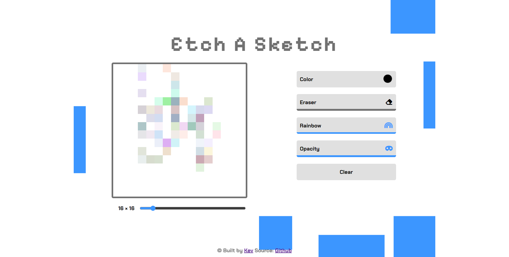
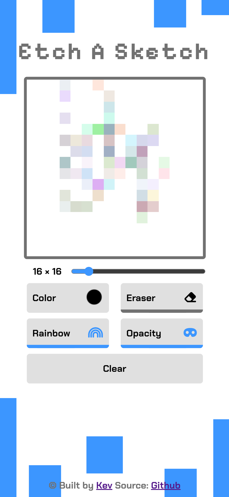

# Etch a Sketch
Back to the days when we used to play with our little etch a sketch. This is the browser version of it where you can draw different pixelated drawings.

- You can draw with the original black color -- old school.
- You can also change the color to any possible color you want.
- Eraser - To make things right
- Rainbow Mode - To draw with different colors changing on every pixels
- Opacity Mode - To toggle the opacity by 0.2 every time you fill the pixel again.
- Bonus Tip * You can also combine Rainbow mode and Opacity Mode to draw an interesting sketch.

Enjoy !

## About the Project
This is a project I created to complete **[The Odin Project](https://www.theodinproject.com/lessons/foundations-etch-a-sketch)** assignment.

The page is fully responsive on both 
Desktop & Mobile * but Drawing on mobile is not yet available. You need to tap every time you want to fill a pixel.

This is my own solution. I wrote every line of codes on my own.

## Screenshots
Desktop

Mobile

## Links
Live Site Url - [Etch a Sketch](https://0xkev21.github.io/etch-a-sketch/)

## Built with
- HTML
- Vanilla CSS
- Vanilla Javascript
- Figma for UI/UX Design

I didn't use any framework or library proving I have full understanding of the fundamentals

## What I learned
Things I have learnt from this project
- How to handle DOM and Events with Javascript
- How to handle Javascript Pointer Events
- How to collect user's input and conditionally response them and show results on a page
- How to make a simple UI with Figma
- How to implement Figma Design into Code

## About Me
I am a student trying to be a self-taught developer.
- My profile - [Github](https://github.com/0xkev21/)

---